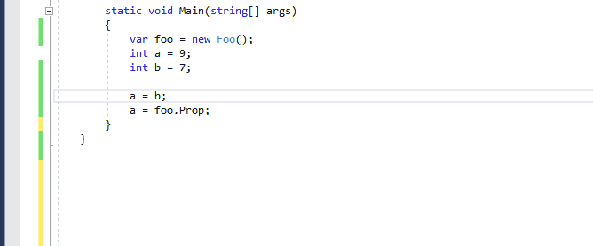
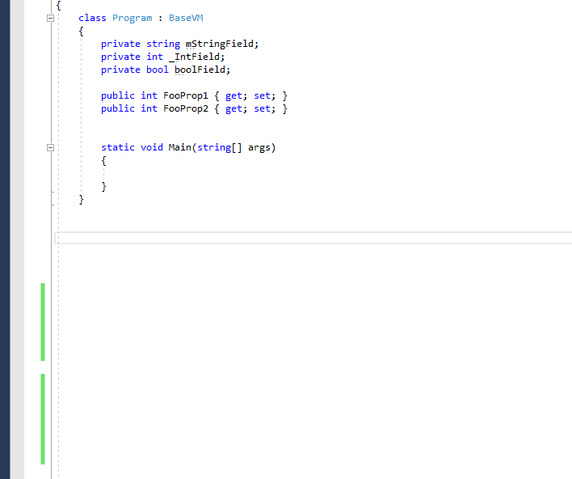
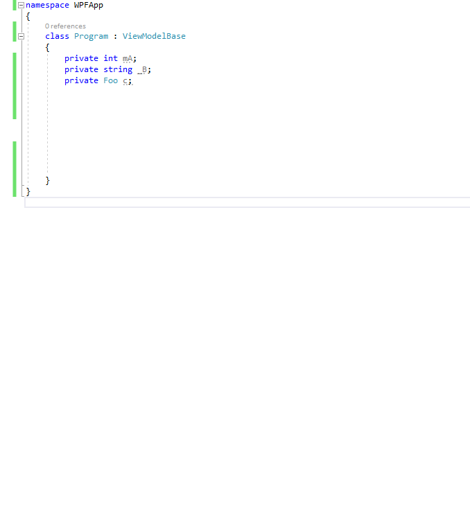
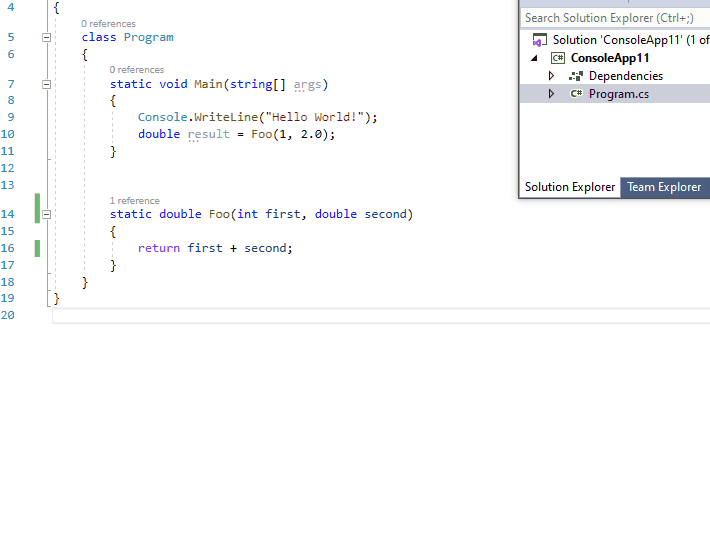
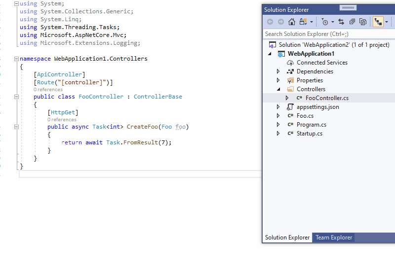
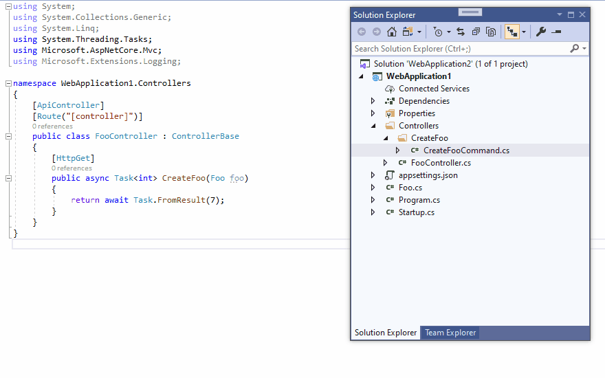
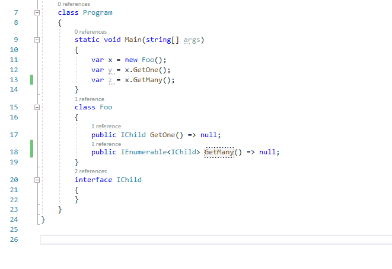
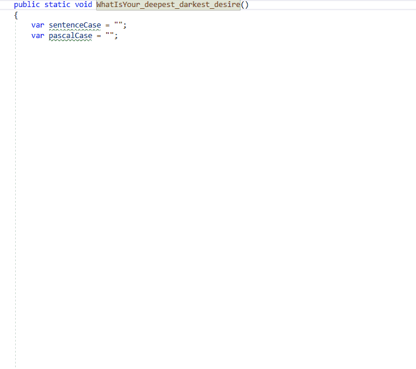

1. [Invert assignment direction](#InvertAssignmentDirection)
2. [Convert to full WPF property](#ConvertToFullWPFProperty)
3. [Encapsulate field for WPF](#EncapsulateFieldForWPF)
4. [Introduce parameter object](#IntroduceParameterObject)
5. [MediatR add RequestHandler and Request](#MediatRAddRequestHandlerAndRequest)
6. [Rename variable after type](#RenameVariableAfterType)
7. [Copy paste with conversion](#CopyPasteWithConversion)
8. [Convert to full Prism WPF property] (#ConvertToFullPrismWpfProperty)

### 1. Invert assignment direction - [download](https://marketplace.visualstudio.com/items?itemName=NeVeS.InvertAssignmentDirection) 

Visual Studio code refactoring that allows swapping arguments around the equal sign in an assignment statement. It works on single or many selected assignment statements at once.

##### Changelog 

version 1.5
- icon added to vsix

version 1.3

- assignment expression that consists of one or two indexers can also be inverted
``
arr[i] = foo[j]; //-> foo[j] = arr[i];
``

### 2. Convert to full WPF Property - [download](https://marketplace.visualstudio.com/items?itemName=NeVeS.ConvertToFullWPFProperty)

Visual Studio code refactoring that replaces an auto-property with full property implementation that consists invocation of OnPropertyChanged in a setter. It can convert many auto-properties at once.

##### Changelog

version 1.5
- icon added to vsix

version 1.4

- performance improvement, a new way of determining the name of a method that usually is called "OnPropertyChanged "
- a more robust way of determining what prefix for a backing field should be used

### 3. Encapsulate field (WPF) - [download](https://marketplace.visualstudio.com/items?itemName=NeVeS.EncapsulateFieldForWPF)

Visual Studio code refactoring that creates full property implementation with an invocation of OnPropertyChanged in a setter for a selected set of backing fields.

##### Changelog

version 1.5
- icon added to vsix

version 1.4
- performance improvement, a new way of determining the name of a method that by convention is called "OnPropertyChanged"

### 4. Introduce parameter object - [download](https://marketplace.visualstudio.com/items?itemName=NeVeS.IntroduceParameterObject)

Visual Studio implementation of code refactoring [Introduce Parameter Object](https://refactoring.com/catalog/introduceParameterObject.html) from Martin Fowler's book "Refactoring, Improving the Design of Existing Code".

##### Limitations 
- it does not support generic type parameters
- updating method body is done syntactically, not semantically, it means they may appear conflicts if a method parameter shares the same name with something else

##### Changelog 

version 1.1
- fixed crash caused by array parameter

### 5. MediatR add RequestHandler and Request - [download](https://marketplace.visualstudio.com/items?itemName=NeVeS.MediatRAddRequestHandlerAndRequest)

Visual Studio code refactoring that adds Command class which implements [MediatR](https://github.com/jbogard/MediatR) IRequest<> interface and handler class which implements [MediatR](https://github.com/jbogard/MediatR) IRequestHandler<> interface.
It only creates empty boilerplate code required by MediatR based on the selected method name and return type.

##### Limitations 
- does not support generic type parameters

##### Changelog 

version 1.5
- RequestHandler can also be generated from an existing Request class

### 6. Rename variable after type - [download](https://marketplace.visualstudio.com/items?itemName=NeVeS.RenameVariableAfterType)

Visual Studio code refactoring that changes a variable name to the name of the variable type, written in camelCase, e.g. "Foo x =" => "Foo foo ="

### 7. Copy/Paste with case conversion - [download](https://marketplace.visualstudio.com/items?itemName=NeVeS.CopyPasteWithConversion)

Visual Studio extensions that adds a new position to the text editor context menu: "Copy/Paste with conversion". It allows to convert a selected text before copying it to the clipboard or before pasting it from the clipboard.
Two kinds of conversion are available:
- changing a text case to: pascal case, snake case, camel case, sentence case
- splitting a text to separate words

| conversion    | before | after |
| ------------- | ------------- | -- |
| Copy As Separate Words  | SampleLongText  | Sample Long Text |
| Copy as sentence case  | SampleLongText  | Sample long text |
| pasteAsCamelCase  | SampleLongText  | sampleLongText |
| PasteAsPascalCase  | SampleLongText  | SampleLongText |
| past_as_snake_case  | SampleLongText  | sample_long_text |
