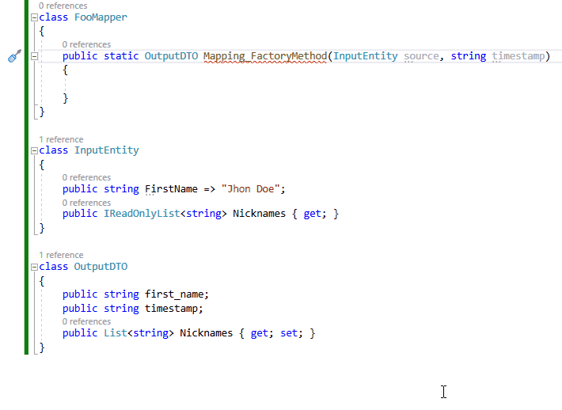
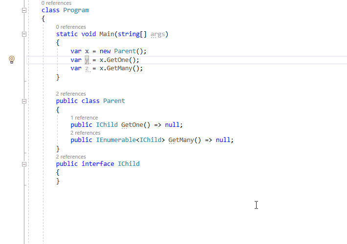

- [Invert assignment direction](#InvertAssignmentDirection)
- [Generate mapping](#GenerateMapping)
- [Introduce parameter object](#IntroduceParameterObject)
- [Rename variable after type/expression](#RenameVariableAfterType)
- [MediatR add RequestHandler and Request](#MediatRAddRequestHandlerAndRequest)
- [Convert to full WPF property](#ConvertToFullWPFProperty)
- [Encapsulate field for WPF](#EncapsulateFieldForWPF)
- [Copy paste with conversion](#CopyPasteWithConversion)

## Invert assignment direction - [download](https://marketplace.visualstudio.com/items?itemName=NeVeS.InvertAssignmentDirection) 

Visual Studio code refactoring that allows swapping arguments around the equal sign in an assignment statement. It works on single or many selected assignment statements at once.

## Generate mapping - [download](https://marketplace.visualstudio.com/items?itemName=NeVeS.GenerateMapping) 

Visual Studio code refactoring that generates mapping code, between method input parameters and method return type. If any of them is void, "this" is used instead. Design time AutoMapper alternative.

What can be generated:

- mapping method
- copy constructor
- memento method get state
- memento method set state

General rules:

- mapping is available only for methods/constructors with an empty body
- mapping can be done for more than one input parameter
- for the left side of the assignment are considered all writable fields and properties
- for the right side of the assignment are considered all readable fields and properties
- for the assignment of mutable reference type, a "new" instance is always created 
- recursive mapping is not, and will not be supported

## Introduce parameter object - [download](https://marketplace.visualstudio.com/items?itemName=NeVeS.IntroduceParameterObject)

Visual Studio implementation of code refactoring [Introduce Parameter Object](https://refactoring.com/catalog/introduceParameterObject.html) from Martin Fowler's book "Refactoring, Improving the Design of Existing Code".

##### Limitations 
- it does not support generic type parameters
- updating method body is done syntactically, not semantically, it means they may appear conflicts if a method parameter shares the same name with something else

## Rename variable after type/expression - [download](https://marketplace.visualstudio.com/items?itemName=NeVeS.RenameVariableAfterType)

Visual Studio code refactoring that changes a variable name, to an auto-generated name from the variable type or expression used in the assignment, e.g. "Foo x =" => "Foo foo ="

- a simple heuristic, not AI based (yet)
- works on a single or many variables at once
- works on a single method parameter

## MediatR add RequestHandler and Request - [download](https://marketplace.visualstudio.com/items?itemName=NeVeS.MediatRAddRequestHandlerAndRequest)

Visual Studio code refactoring that adds Command class which implements [MediatR](https://github.com/jbogard/MediatR) IRequest<> interface and handler class which implements [MediatR](https://github.com/jbogard/MediatR) IRequestHandler<> interface.
It only creates empty boilerplate code required by MediatR based on the selected method name and return type.

##### Limitations 
- does not support generic type parameters

##### Changelog 

version 1.5
- RequestHandler can also be generated from an existing Request class

## Convert to full WPF Property - [download](https://marketplace.visualstudio.com/items?itemName=NeVeS.ConvertToFullWPFProperty)

Visual Studio code refactoring that replaces an auto-property with full property implementation that consists invocation of OnPropertyChanged in a setter. It can convert many auto-properties at once.

## Encapsulate field (WPF) - [download](https://marketplace.visualstudio.com/items?itemName=NeVeS.EncapsulateFieldForWPF)

Visual Studio code refactoring that creates full property implementation with an invocation of OnPropertyChanged in a setter for a selected set of backing fields.

## Copy/Paste with case conversion - [download](https://marketplace.visualstudio.com/items?itemName=NeVeS.CopyPasteWithConversion)

Visual Studio extension that adds two commands to the text editor context menu that do case conversion before copy/paste. 

Two kinds of conversion are available:
- Copy as sentence case (also splits selected text to separate words)
- PasteAsPascalCase
